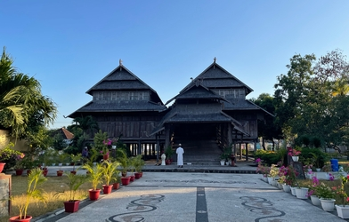

# Multi-CAST Sumbawa

## How to cite

If you use these data please cite
- the original source
  > Shiohara, Asako. 2023. Multi-CAST Sumbawa. In Haig, Geoffrey & Schnell, Stefan (eds.), Multi-CAST: Multilingual corpus of annotated spoken texts. Version 2311. Bamberg: University of Bamberg. (multicast.aspra.uni-bamberg.de/#sumbawa) (date accessed)
- the derived dataset using the DOI of the [particular released version](../../releases/) you were using



## Description


**Sumbawa** ([sumb1241](https://glottolog.org/resource/languoid/id/sumb1241), indigenous designation: Samawa) is a Western Austronesian language spoken in the western part of Sumbawa Island, Indonesia. Administratively, the area belongs to two districts, namely Sumbawa district (Kabupaten Sumbawa) and West Sumbawa district (Kabupaten Sumbawa Barat), in the province of West Nusa Tenggara (Nusa Tenggara Barat). Sumbawa belongs to the Bali-Sasak-Sumbawa subgroup of the Malayo-Polynesian branch of the Austronesian language family ([Adelaar 2005](Source#cldf:adelaar2005); [Mbete 1990](Source#cldf:mbete1990)).

The texts in this corpus were collected by Asako Shiohara in 1996 and 1997. They were recorded in the small town of Empang and in Desa Bantu, a village close to Empang. Among the several dialects of the Sumbawa language, the dialect spoken in these two locations is classified as the Sumbawa Besar dialect, which is distributed across a large part of the western Sumbawa-speaking area.

The texts were annotated for Multi-CAST by Shiohara between 2018 and 2022, with RefIND annotations added in 2022 by Tai Hong.

This dataset is licensed under a CC-BY-4.0 license

Available online at https://multicast.aspra.uni-bamberg.de/#sumbawa


```geojson
{
    "type": "FeatureCollection",
    "features": [
        {
            "type": "Feature",
            "geometry": {
                "type": "Point",
                "coordinates": [
                    117.472,
                    -8.71919
                ]
            }
        },
        {
            "type": "Feature",
            "geometry": {
                "type": "Polygon",
                "coordinates": [
                    [
                        [
                            112.472,
                            -3.7191899999999993
                        ],
                        [
                            122.472,
                            -3.7191899999999993
                        ],
                        [
                            122.472,
                            -13.71919
                        ],
                        [
                            112.472,
                            -13.71919
                        ],
                        [
                            112.472,
                            -3.7191899999999993
                        ]
                    ]
                ]
            }
        }
    ]
}
```


## Corpus counts

Only a small number of basic GRAID symbols are counted:

*Function symbols*
- ⟨0⟩ zero
- ⟨pro⟩ definite pronoun
- ⟨np⟩ full noun phrase
- ⟨other⟩ form not further specified

*Person/Animacy symbols*
- ⟨.1⟩ first person
- ⟨.2⟩ second person
- ⟨.h⟩ third person, human
- ⟨.d⟩ third person, anthropomorphic
- ø third person, non-human

*Function symbols*
- ⟨:s⟩ subject of an intransitive clause
- ⟨:a⟩ subject of a transitive clause
- ⟨:ncs⟩ non-canonical subject
- ⟨:p⟩ direct object
- ⟨:obl⟩ oblique argument
- ⟨:g⟩ goal argument
- ⟨:l⟩ locational argument
- ⟨:pred⟩ predicate
- ⟨:poss⟩ possessive
- ⟨:other⟩ function not further specified

Only basic categories are listed; categories represented by complex symbols with additional
specifiers (e.g. ⟨dem_pro⟩ ‘demonstrative pronoun’) have been subsumed under the more basic
category (e.g. ⟨pro⟩ ‘definite pronoun’). Please refer to the annotation notes for this corpus for
information on all annotated categories, including those not listed here.

| GRAID | ⟨:s⟩ | ⟨:a⟩ | ⟨:ncs⟩ | ⟨:p⟩ | ⟨:obl⟩ | ⟨:g⟩ | ⟨:l⟩ | ⟨:pred⟩ | ⟨:poss⟩ | ⟨:other⟩ | totals |
|:--------------|-------:|-------:|---------:|-------:|---------:|-------:|-------:|----------:|----------:|-----------:|---------:|
| **⟨0.1⟩** | 8 | 15 | 0 | 0 | 0 | 0 | 0 | 0 | 0 | 0 | 23 |
| **⟨0.2⟩** | 8 | 10 | 0 | 1 | 0 | 0 | 0 | 0 | 0 | 0 | 19 |
| **⟨0.h⟩** | 154 | 128 | 0 | 31 | 1 | 0 | 0 | 0 | 0 | 0 | 314 |
| **⟨0.d⟩** | 3 | 2 | 0 | 0 | 0 | 0 | 0 | 0 | 0 | 0 | 5 |
| **⟨0⟩** | 72 | 2 | 0 | 69 | 1 | 1 | 8 | 0 | 0 | 9 | 162 |
| **⟨pro.1⟩** | 33 | 56 | 0 | 13 | 2 | 3 | 0 | 1 | 41 | 1 | 150 |
| **⟨pro.2⟩** | 15 | 20 | 0 | 6 | 1 | 1 | 0 | 0 | 14 | 0 | 57 |
| **⟨pro.h⟩** | 41 | 42 | 0 | 1 | 3 | 0 | 0 | 1 | 8 | 2 | 98 |
| **⟨pro.d⟩** | 0 | 0 | 0 | 0 | 0 | 0 | 0 | 0 | 0 | 0 | 0 |
| **⟨pro⟩** | 34 | 1 | 0 | 6 | 2 | 8 | 14 | 10 | 1 | 4 | 80 |
| **⟨np.1⟩** | 0 | 0 | 0 | 0 | 0 | 0 | 0 | 0 | 0 | 0 | 0 |
| **⟨np.2⟩** | 0 | 0 | 0 | 0 | 0 | 0 | 0 | 0 | 0 | 0 | 0 |
| **⟨np.h⟩** | 99 | 49 | 0 | 32 | 15 | 5 | 3 | 10 | 28 | 14 | 255 |
| **⟨np.d⟩** | 8 | 2 | 0 | 0 | 3 | 3 | 0 | 0 | 1 | 0 | 17 |
| **⟨np⟩** | 241 | 9 | 0 | 197 | 10 | 34 | 65 | 87 | 10 | 49 | 702 |
| **⟨other.1⟩** | 0 | 0 | 0 | 0 | 0 | 0 | 0 | 0 | 0 | 0 | 0 |
| **⟨other.2⟩** | 0 | 0 | 0 | 0 | 0 | 0 | 0 | 0 | 0 | 0 | 0 |
| **⟨other.h⟩** | 0 | 0 | 0 | 0 | 0 | 0 | 0 | 0 | 0 | 0 | 0 |
| **⟨other.d⟩** | 0 | 0 | 0 | 0 | 0 | 0 | 0 | 0 | 0 | 0 | 0 |
| **⟨other⟩** | 0 | 0 | 0 | 0 | 0 | 0 | 0 | 8 | 0 | 2 | 10 |
| | 716 | 336 | 0 | 356 | 38 | 55 | 90 | 117 | 103 | 81 | 1892 |


**Clause boundaries**

| GRAID | count |
|:-----------|--------:|
| **⟨##⟩** | 0 |
| **⟨#⟩** | 1084 |
| **totals** | 1084 |


## Corpus metadata

- [Annotation notes](cldf/media/annotation-notes.pdf)
- [Translated texts](cldf/media/translated-texts.pdf)


## CLDF Datasets

The following CLDF datasets are available in [cldf](cldf):

- CLDF [TextCorpus](https://github.com/cldf/cldf/tree/master/modules/TextCorpus) at [cldf/TextCorpus-metadata.json](cldf/TextCorpus-metadata.json)